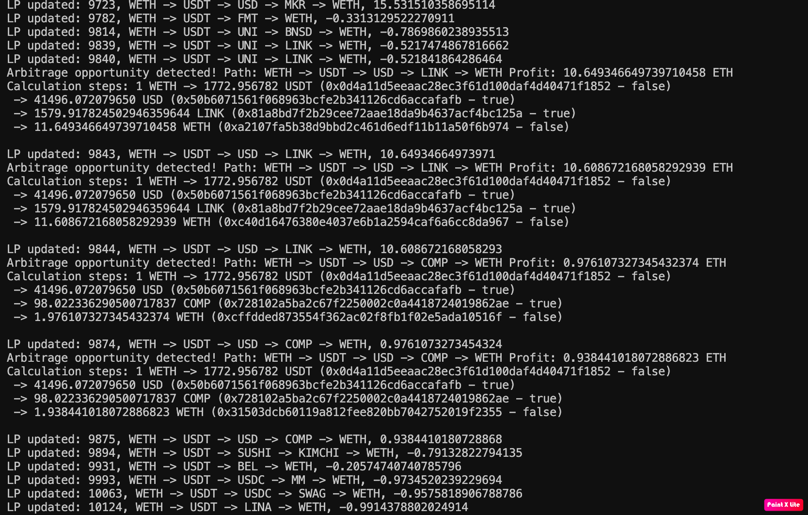

# AMM Arbitrage Detection Service

A real-time service that monitors Automated Market Maker (AMM) pools for arbitrage opportunities across different DEXes. The service tracks pool reserves, calculates potential arbitrage paths, and broadcasts opportunities via WebSocket.

## Features

- Real-time monitoring of Uniswap V2 pool reserves
- Multi-hop arbitrage path detection
- WebSocket-based real-time updates
- Efficient batch processing of pool updates
- Connection pooling and load balancing
- Graceful error handling and reconnection logic

## Prerequisites

- Node.js (v16 or higher)
- Yarn or npm
- An Infura API key (for Ethereum mainnet access)

## Installation

1. Clone the repository:
```bash
git clone <repository-url>
cd detect-amm-imbalance
```

2. Install dependencies:
```bash
yarn install
# or
npm install
```

3. Create a `.env` file in the root directory with your Infura API key:
```env
INFURA_API_KEY=your_infura_api_key_here
```

## Project Structure

```
src/
├── app/                 # Main application logic
│   └── App.ts          # Application initialization and lifecycle
├── config/             # Configuration files
│   └── constants.ts    # Global constants and settings
├── database/           # Database management
│   └── dbManager.ts    # Database operations and caching
├── server/             # WebSocket server
│   └── webSocketServer.ts  # WebSocket connection handling
├── services/           # Core services
│   ├── arbitrageCalculator.ts  # Arbitrage calculation logic
│   ├── eventSubscriber.ts      # Blockchain event monitoring
│   └── webSocketPool.ts        # WebSocket connection pooling
└── types/              # TypeScript type definitions
```

## Running the Service

1. Start the service:
```bash
yarn start
# or
npm start
```

This is the running screen for detecting LP price update




2. The service will:
   - Initialize the database
   - Connect to Ethereum mainnet
   - Start monitoring pool reserves
   - Begin broadcasting arbitrage opportunities

## WebSocket API

The service exposes a WebSocket server that broadcasts arbitrage opportunities in real-time.

### Connection

Connect to the WebSocket server:
```javascript
const ws = new WebSocket('ws://localhost:8080');
```

### Message Format

Arbitrage opportunities are broadcast in the following format:
```typescript
interface ArbitrageUpdate {
  pathId: string;        // Unique identifier for the arbitrage path
  pathDescription: string; // Human-readable path description (e.g., "ETH -> USDC -> DAI -> ETH")
  rate: number;          // Profit rate in ETH
}
```

### Example Usage

```javascript
const ws = new WebSocket('ws://localhost:8080');

ws.onmessage = (event) => {
  const update = JSON.parse(event.data);
  console.log(`Arbitrage opportunity found!`);
  console.log(`Path: ${update.pathDescription}`);
  console.log(`Profit: ${update.rate} ETH`);
};
```

## Configuration

Key configuration parameters can be found in `src/config/constants.ts`:

- `START_AMOUNT`: Initial amount for arbitrage calculations
- `FEE_PERCENT`: Trading fee percentage
- `BATCH_SIZE`: Number of pools to process in each batch
- `WEB_SERVER_PORT`: WebSocket server port
- `INFURA_API_KEY`: Your Infura API key

## Error Handling

The service includes comprehensive error handling:
- Automatic reconnection for WebSocket connections
- Graceful shutdown on process termination
- Mutex-based concurrent update protection
- Event deduplication using LRU cache

## Logging

The service logs important events to both console and file:
- Arbitrage opportunities
- Connection status
- Error conditions
- Pool updates

Logs are written to `arbitrage.log` in the project root.

## Contributing

1. Fork the repository
2. Create your feature branch (`git checkout -b feature/amazing-feature`)
3. Commit your changes (`git commit -m 'Add some amazing feature'`)
4. Push to the branch (`git push origin feature/amazing-feature`)
5. Open a Pull Request


## License

This project is licensed under the MIT License - see the [LICENSE](LICENSE) file for details.
